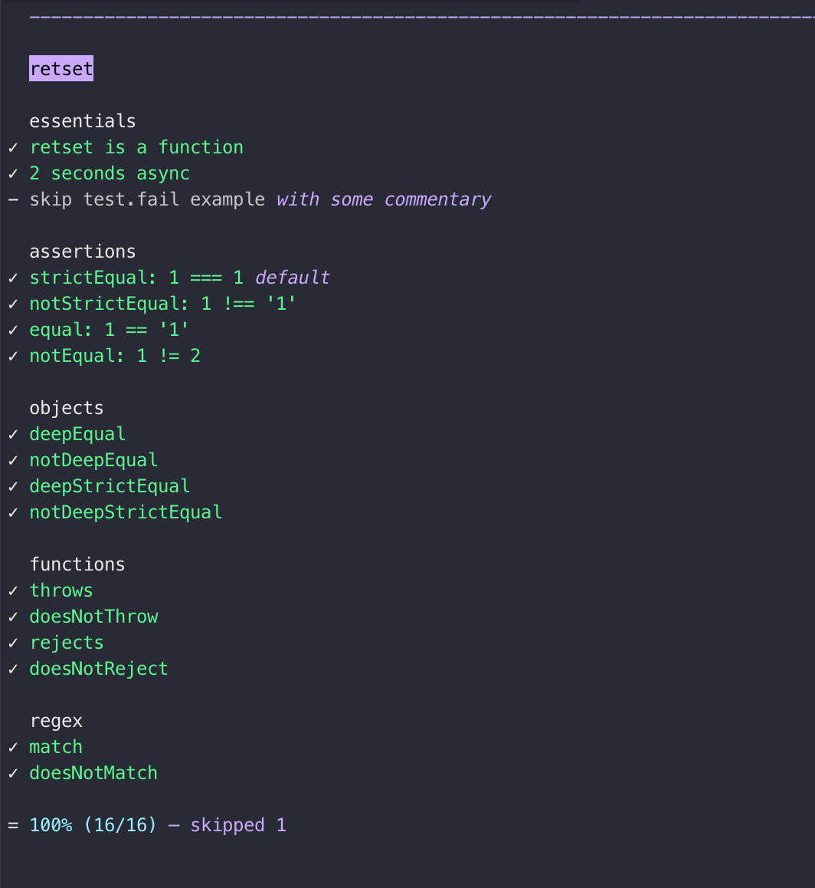

# a-ok

> if you run node > 19 use [`node:test`](https://nodejs.org/api/test.html)

- super simple (stupid) test runner using node's built-in `assert` module
- no dependencies
- almost no code
- use [ava](https://github.com/avajs/ava) for heavier testing

```js
import test from 'a-ok'

// default assertion: strictEqual
test('the function returns what we expect', theFunction(), 'what we expect')

// use any assert method: https://nodejs.org/api/assert.html
test.notStrictEqual('numbers are not strings', 123, '123')

// async
test.deepEqual('response', fetchApi(), expectedObject)

// reminder for later
test.skip('compare apples to oranges')

// commentary
test('3 === 3', 3, 3, 'three is the magic number')

// tidy console output
test.group('level-1')
test.label('level-2')
```


